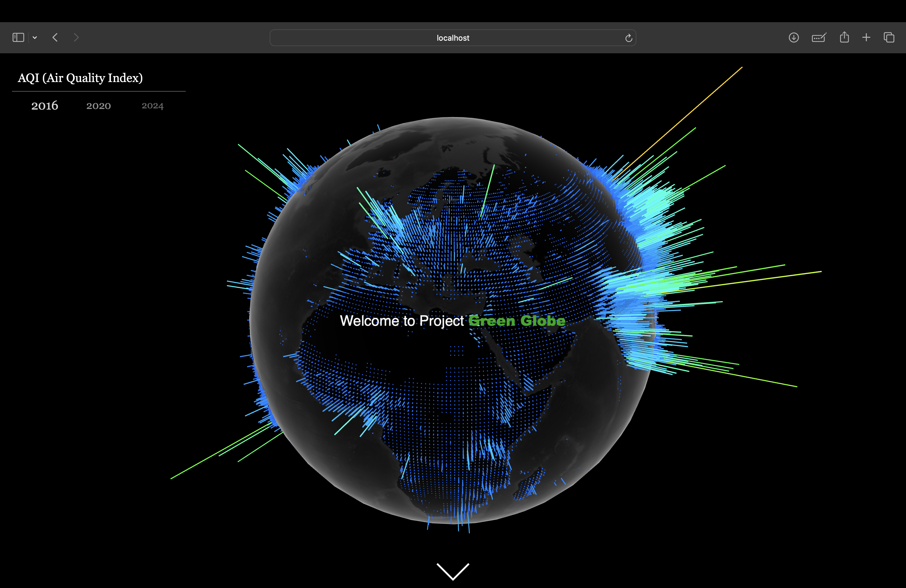
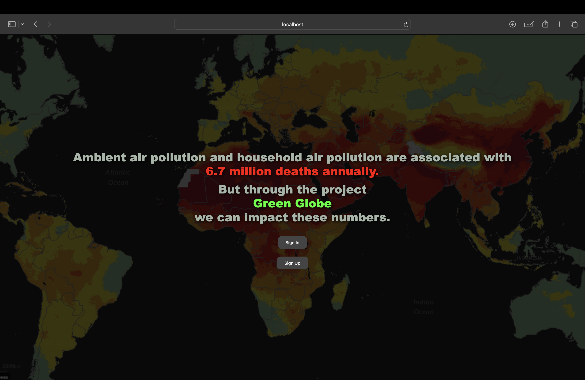
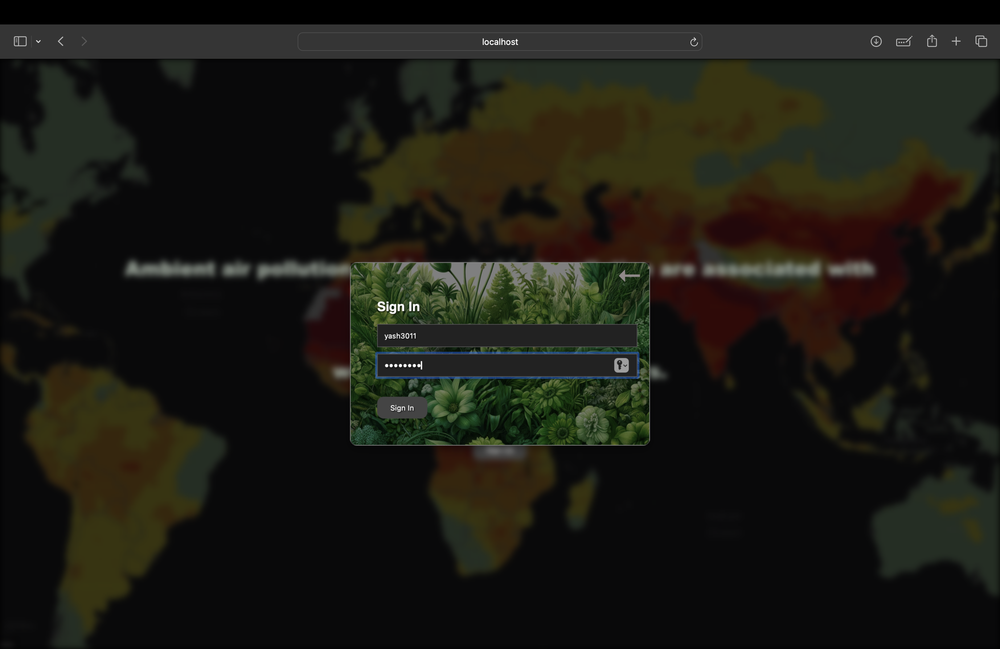
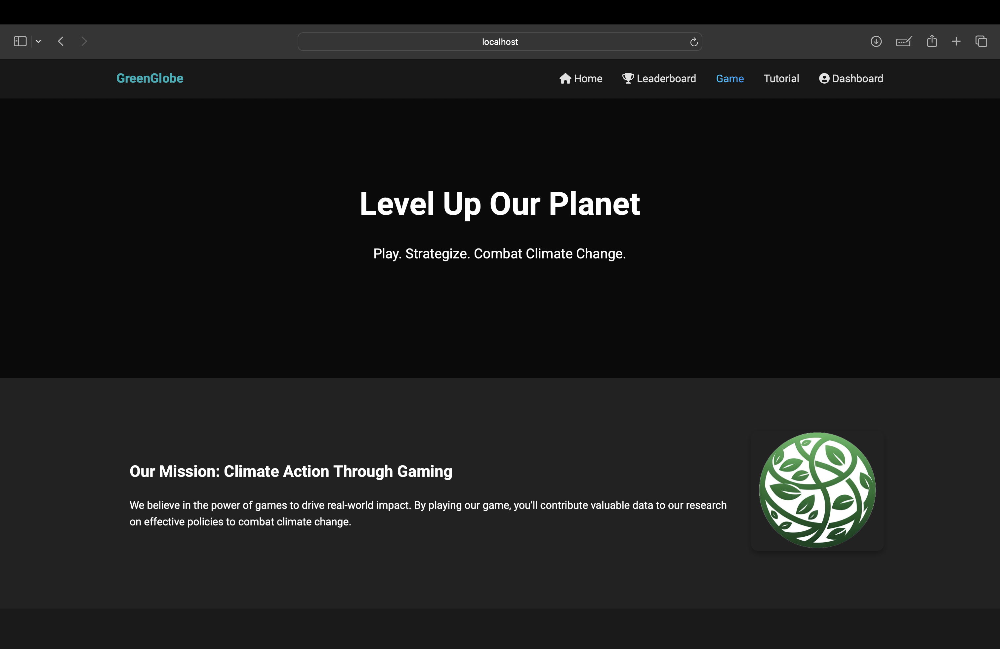
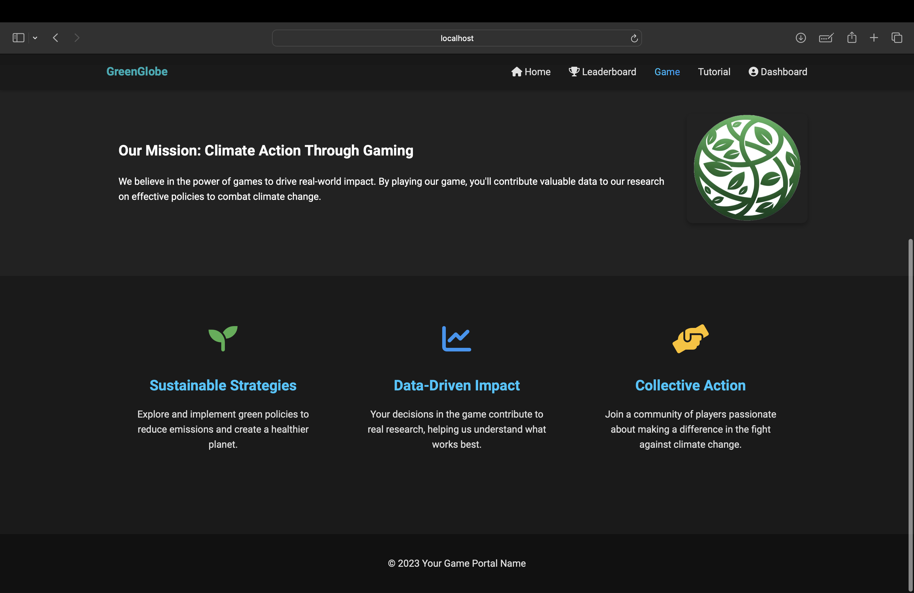
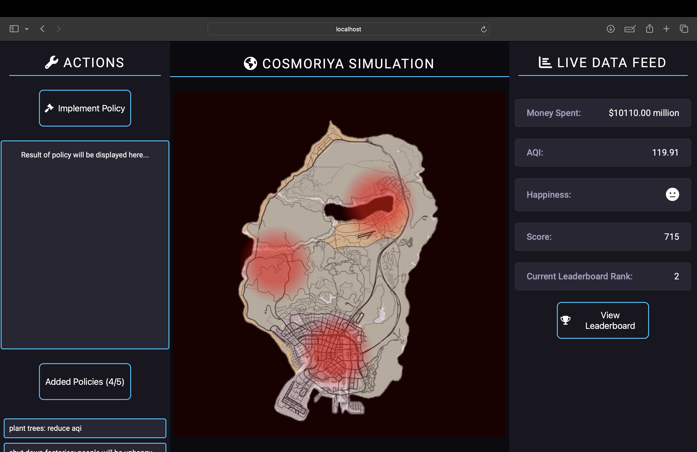
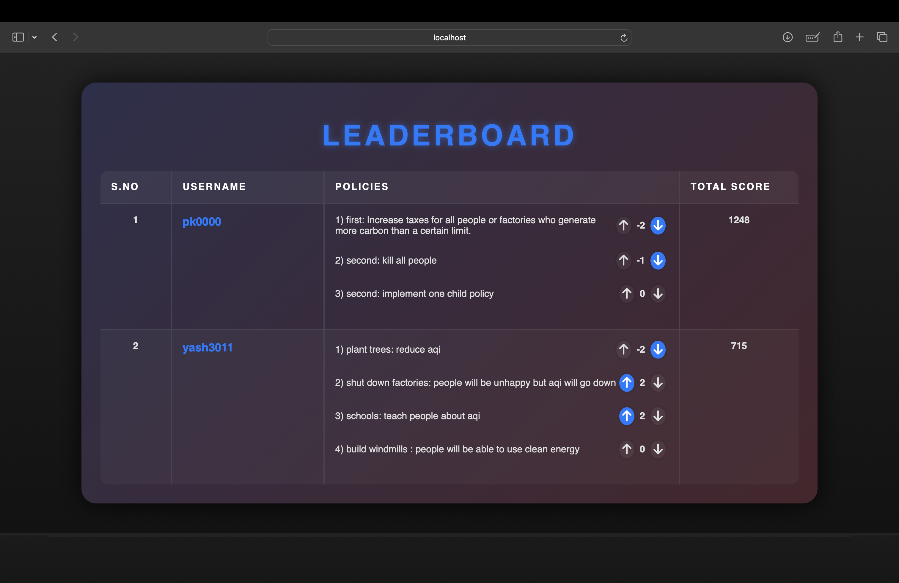
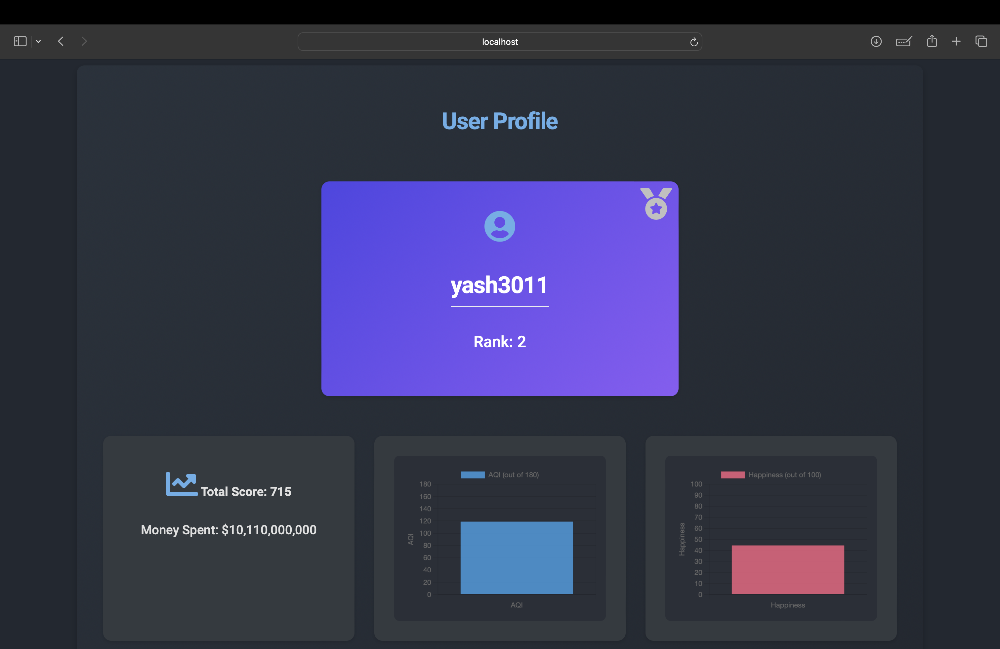
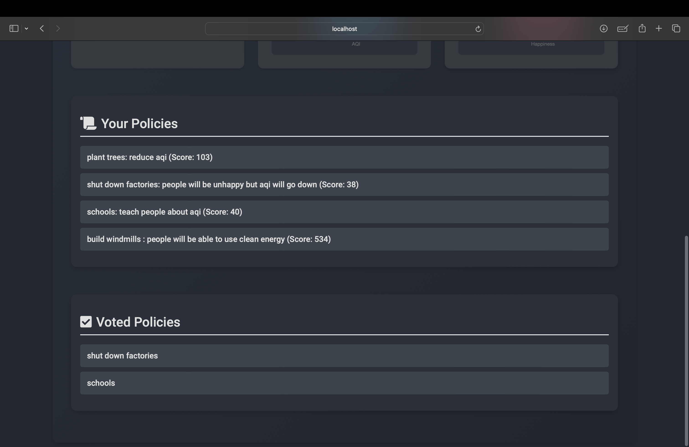

# GreenGlobe

Welcome to GreenGlobe, an interactive platform designed to harness the power of games to drive real-world impact on climate change. This detailed README will guide you through the technical aspects, features, and functionality of our website.

## Table of Contents

1. [Introduction](#introduction)
2. [Features](#features)
   - [Globe Landing Page](#globe-landing-page)
   - [Sign Up/Sign In](#sign-upsign-in)
   - [Tutorial Page](#tutorial-page)
   - [Home Page](#home-page)
   - [Game Page](#game-page)
   - [Leaderboard](#leaderboard)
   - [User Dashboard](#user-dashboard)
3. [Technologies Used](#technologies-used)
4. [Installation](#installation)
5. [Usage](#usage)
6. [Contributing](#contributing)
7. [License](#license)

## Introduction

GreenGlobe is an innovative web platform that utilizes interactive gaming to gather valuable data on effective policies to combat climate change. By engaging users in a dynamic and educational experience, we aim to collect actionable insights while demonstrating the complexities of environmental policy-making.

## Features

### Globe Landing Page




- **3D Interactive Globe**: The home page features a responsive 3D globe created using `three.js`, providing a visually appealing and interactive starting point for users.
- **Awareness Message**: As users scroll down, they are presented with a stark reminder of the impact of air pollution, highlighting the urgency of climate action.

### Sign Up/Sign In



- **OTP Verification**: Users can sign up with email verification powered by SendGrid, ensuring secure account creation.
- **User Flow**: New users are directed to the tutorial page after signing up, while returning users are taken directly to the home page.

### Tutorial Page


- **Game Instructions**: This page explains the game's mechanics, objectives, and the significance of each feature, ensuring users are well-prepared to participate.

### Home Page




- **Mission Statement**: Our mission is to leverage gaming for real-world impact. Users contribute to research on effective climate policies by engaging with our game.
- **Navigation**: Users can access various sections of the site, including the dashboard, game, leaderboard, and tutorial page.

### Game Page



- **Interactive Gameplay**: The game page is divided into three sections: Actions, Cosmoriya Simulation, and Info.
  - **Actions**: Users implement policies as the president of Cosmoriya, a fictional country with a high AQI of 180.
  - **API Integration**: Policies are analyzed by Gemini AI, providing detailed feedback on their impact, including cost, AQI changes, and public happiness.
  - **Real-Time Updates**: The Info section dynamically displays updated metrics such as money spent, AQI, happiness, and user score.
  - **Confetti Celebration**: Users who achieve a top 10 score are celebrated with a confetti blast on the screen.

### Leaderboard



- **Real-Time Rankings**: The leaderboard showcases the top 10 scores, allowing users to see how their policies compare.
- **Voting System**: Users can upvote or downvote policies, influencing their visibility and ranking. Policies with -10 votes are automatically removed.

### User Dashboard




- **Personal Metrics**: Displays user-specific information, including username, rank, and policy impact metrics.
- **Charts and Medals**: Beautiful charts visualize the impact of the user's policies. Top 3 users are awarded medals (gold, silver, or bronze).

## Technologies Used

- **Frontend**: HTML, CSS, JavaScript, Three.js
- **Backend**: Node.js, Express.js
- **Database**: MongoDB (hosted on AWS)
- **Email Verification**: SendGrid
- **AI Analysis**: Gemini AI

## Installation

1. Clone the repository:

   ```bash
   git clone https://github.com/Yash1361/vsGreenGlobe.git

2. Navigate to the project directory:

   ```bash
   cd greenglobe

3. Install the dependencies:

   ```bash
   npm install

4. Set up environment variables:
   - Create a .env file in the root directory.
   - Add your MongoDB URI, SendGrid API key, and other necessary environment variables.
  
## Usage

1. Start the server:

   ```bash
   npm start

2. Open your browser and navigate to http://localhost:3000

## Contributing

We welcome contributions to GreenGlobe! Please follow these steps to contribute:

1. Fork the repository.

2. Create a new branch:

   ```bash
   git checkout -b feature/your-feature-name

3. Commit your changes:

   ```bash
   git commit -m 'Add some feature'

4. Push to the branch:

   ```bash
   git push origin feature/your-feature-name

5. Open a pull request.

## License

This project is licensed under a Proprietary License. See the [LICENSE](./LICENSE.txt) file for more details.

